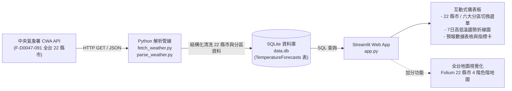

# HW10 - Taiwan Weather Forecast

> **從氣象資料到互動式天氣預報應用程式**  
> 資料獲取 · 資料分析 · 資料儲存 · 資料查詢 · 視覺化展示  
> 技術棧：`CWA Open Data API` × `JSON` × `Python` × `SQLite` × `Streamlit` × `Folium`

---

## 系統整體架構與流程圖 (System Architecture)



---

## 專案功能特色

1. **涵蓋全台 22 縣市與六大地理分區**：
   - **北部**：基隆市、臺北市、新北市、桃園市、新竹市、新竹縣、苗栗縣
   - **中部**：臺中市、彰化縣、南投縣、雲林縣、嘉義市、嘉義縣
   - **南部**：臺南市、高雄市、屏東縣
   - **東部/東北/東南**：宜蘭縣、花蓮縣、臺東縣
   - **離島**：澎湖縣、金門縣、連江縣
2. **即時 CWA API 連線**：支援個人 API Key 自動擷取氣象署即時 7 天預報。
3. **SQLite 資料庫儲存**：遵循作業規範，前端透過 SQL 查詢本機 `data.db`。
4. **互動式視覺化儀表板**：提供最高溫 (MaxT) / 最低溫 (MinT) 折線圖、KPI 指標卡與每日預報表格。
5. **全台互動溫度地圖 (Folium)**：22 縣市座標精準定位，4 階溫度色階圓點標記與點擊 Popup 預報卡。

---

## 專案目錄結構 (Project Structure)

```text
weather/
├── fetch_weather.py     # Gate 1: 呼叫 CWA API 取得全台 22 縣市原始 JSON 資料
├── parse_weather.py     # Gate 2: 解析 JSON，提取全台 22 縣市與分區 7 天氣溫並產出 CSV
├── database.py          # Gate 3: 建立 SQLite 資料庫與批次匯入資料
├── app.py               # Gate 4 & 5: Streamlit 互動式 Web App 與全台 22 縣市地圖視覺化
├── data.db              # Gate 3: SQLite 資料庫檔案 (本機快取)
├── raw_weather.json     # (產出) 原始 API 回傳 JSON 快取
├── weather_data.csv     # (產出) 清洗後的預報資料 CSV (共 203 筆)
├── requirements.txt     # 專案相依套件清單
├── .env.example         # CWA API Key 環境變數範本
├── .env                 # (本機私有) 個人 CWA API Key
├── .gitignore           # Git 忽略設定 (.env, data.db, venv 等)
├── README.md            # 專案說明與工作流程文件
└── workflow.md          # 專案詳細工作流程指引
```

---

## 快速啟動 (Quick Start)

### 1. 安裝必要套件
```bash
pip install -r requirements.txt
```

### 2. 設定 CWA API Key
在專案目錄 `.env` 填入中央氣象署授權碼：
```env
CWA_API_KEY=您的CWA授權碼
```

### 3. 一鍵執行資料處理管線
```bash
python fetch_weather.py
python parse_weather.py
python database.py
```

### 4. 啟動 Streamlit Web 應用
```bash
streamlit run app.py
```
啟動後前往 `http://localhost:8501`。
