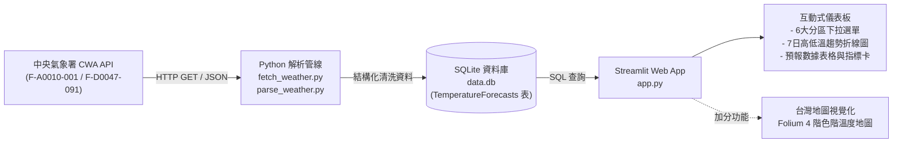

# HW10 - Taiwan Weather Forecast

> **從氣象資料到互動式天氣預報應用程式**  
> 資料獲取 · 資料分析 · 資料儲存 · 資料查詢 · 視覺化展示  
> 技術棧：`CWA Open Data API` × `JSON` × `Python` × `SQLite` × `Streamlit` × `Folium`

---

## 系統整體架構與流程圖 (System Architecture)



---

## 專案目錄結構 (Project Structure)

```text
weather/
├── fetch_weather.py     # Gate 1: 呼叫 CWA API 取得原始 JSON 資料並快取
├── parse_weather.py     # Gate 2: 解析 JSON，提取六大區域一週氣溫資料並產出 CSV
├── database.py          # Gate 3: 建立 SQLite 資料庫與批次匯入資料
├── app.py               # Gate 4 & 5: Streamlit 互動式 Web App 與 Folium 地圖視覺化
├── data.db              # Gate 3: SQLite 資料庫檔案 (本機快取)
├── raw_weather.json     # (產出) 原始 API 回傳 JSON 快取
├── weather_data.csv     # (產出) 清洗後的預報資料 CSV
├── requirements.txt     # 專案相依套件清單
├── .env.example         # CWA API Key 環境變數範本
├── .env                 # (本機私有) 個人 CWA API Key
├── .gitignore           # Git 忽略設定 (.env, data.db, venv 等)
├── README.md            # 專案說明與工作流程文件
└── workflow.md          # 專案詳細工作流程指引
```

---

## 環境建置與安裝 (Prerequisites)

### 1. 建立並啟動虛擬環境 (建議)
- **Windows (PowerShell)**:
  ```powershell
  python -m venv venv
  .\venv\Scripts\activate
  ```
- **macOS / Linux**:
  ```bash
  python3 -m venv venv
  source venv/bin/activate
  ```

### 2. 安裝必要套件
```bash
pip install -r requirements.txt
```

---

## 快速啟動 (Quick Start)

### 步驟一：設定 CWA API Key
複製 `.env.example` 為 `.env` 並填入中央氣象署授權碼：
```env
CWA_API_KEY=您的CWA授權碼
```

### 步驟二：執行一鍵資料處理管線
```bash
python fetch_weather.py
python parse_weather.py
python database.py
```

### 步驟三：啟動 Streamlit 氣溫預報 Web 應用
```bash
streamlit run app.py
```

---

## 五個 Gate 詳細工作流程 (Five Gates Workflow)

---

### Gate 1: 取得 CWA API 資料 (權重：20%)
- **程式**：`fetch_weather.py`
- **目標**：使用交通部中央氣象署 (CWA) 開放資料平台 API 取得台灣六大區域一週天氣預報。
- **資料集**：`F-A0010-001` / `F-D0047-091` (臺灣各區/縣市一週天氣預報)
- **涵蓋六大分區**：
  1. 北部地區
  2. 中部地區
  3. 南部地區
  4. 東北部地區
  5. 東部地區
  6. 東南部地區
- **主要機制**：
  - 支援從 `.env` 讀取 `CWA_API_KEY`（保護個人金鑰不洩漏）。
  - 將原始資料結構化儲存為 `raw_weather.json`，支援離線與快取。

---

### Gate 2: 分析 JSON，提取氣溫資料 (權重：20%)
- **程式**：`parse_weather.py`
- **目標**：分析 `raw_weather.json`，萃取六大分區未來一週（7天）每日之 **最低氣溫 (MinT)** 與 **最高氣溫 (MaxT)**。
- **輸出規格**：
  - 標準欄位：`regionName`、`dataDate`、`minT`、`maxT`
  - 儲存產出：`weather_data.csv`
- **資料範例**：
  | regionName | dataDate | minT | maxT |
  | :--- | :---: | :---: | :---: |
  | 北部地區 | 2026-09-24 | 22.0 | 29.0 |
  | 中部地區 | 2026-09-24 | 23.0 | 31.0 |
  | 南部地區 | 2026-09-24 | 25.0 | 33.0 |
  | 東北部地區 | 2026-09-24 | 21.0 | 27.0 |
  | 東部地區 | 2026-09-24 | 22.0 | 28.0 |
  | 東南部地區 | 2026-09-24 | 24.0 | 30.0 |

---

### Gate 3: 存入 SQLite 資料庫 (權重：20%)
- **程式**：`database.py`
- **目標**：建立 SQLite 資料庫 `data.db`，設計資料表 `TemperatureForecasts` 並匯入清洗後的預報資料。
- **資料表結構 (Schema)**：
  ```sql
  CREATE TABLE IF NOT EXISTS TemperatureForecasts (
      id INTEGER PRIMARY KEY AUTOINCREMENT,
      regionName TEXT NOT NULL,
      dataDate TEXT NOT NULL,
      minT REAL NOT NULL,
      maxT REAL NOT NULL
  );
  ```
- **驗證 SQL 查詢**：
  1. 列出所有地區：`SELECT DISTINCT regionName FROM TemperatureForecasts;`
  2. 查詢中部地區預報：`SELECT * FROM TemperatureForecasts WHERE regionName = '中部地區';`

---

### Gate 4: Streamlit 氣溫預報 Web App (權重：40%)
- **程式**：`app.py`
- **目標**：建立互動式 Web 應用程式，**嚴格遵循架構原則直接從 SQLite (`data.db`) 讀取資料**。
- **主要功能**：
  1. **地區選擇**：下拉選單切換六大區域。
  2. **溫度趨勢折線圖**：最高溫（MaxT 紅線）與最低溫（MinT 藍線）清晰呈現。
  3. **資料表格**：顯示該地區 7 日之完整預報數據與平均溫。
  4. **統計指標卡片 (Metrics)**：呈現一週平均溫、最高溫、最低溫與週期溫差。

---

### Gate 5: 進階：台灣地圖視覺化 (加分項 / Optional)
- **程式**：`app.py` (整合 `Folium` + `streamlit-folium`)
- **目標**：互動式台灣地圖標記六大區域地理中心，並依當日「平均溫度」自動套用 4 階色階與 Popup 資訊卡。
- **溫度色階規則**：
  | 溫度區間 (平均溫) | 代表顏色 | 狀態說明 |
  | :--- | :---: | :--- |
  | **< 20°C** | 藍色 (`blue`) | 涼冷氣候 |
  | **20°C ~ 25°C** | 綠色 (`green`) | 舒適溫和 |
  | **25°C ~ 30°C** | 橙黃色 (`orange`) | 溫暖偏熱 |
  | **> 30°C** | 紅色 (`red`) | 酷熱高溫 |
- **點擊 Popup 資訊**：地區名稱、日期、最低溫、最高溫、平均溫。

---

## 執行與交付檢驗清單 (Execution Checklist)

### 階段一：資料處理管線
- [x] 執行 `python fetch_weather.py`：驗證取得 CWA API JSON 並儲存 `raw_weather.json`。
- [ ] 執行 `python parse_weather.py`：驗證六大分區、7 天氣溫清洗與 CSV 產出。
- [ ] 執行 `python database.py`：驗證 SQLite `data.db` 與 `TemperatureForecasts` 表已正確寫入。

### 階段二：Web 應用程式啟動與展示
- [ ] 執行 `streamlit run app.py`。
- [ ] 測試地區下拉選單切換，確認折線圖與表格連動。
- [ ] 檢驗台灣地圖標記、4 階色階邏輯與 Popup 資訊卡。

---

## 重要注意事項 (Important Notes)
1. **安全性原則**：個人 CWA API Key 存放在 `.env` 中，已由 `.gitignore` 保護，絕不公開推送至 GitHub。
2. **架構原則**：Streamlit 必須透過 SQL 從本機 SQLite (`data.db`) 查詢資料，**不可在 Web App 前端直接呼叫 API**。
3. **完整性原則**：必須確認「北部、中部、南部、東北部、東部、東南部」六大分區完整收錄，資料天數涵蓋一週 7 天。
