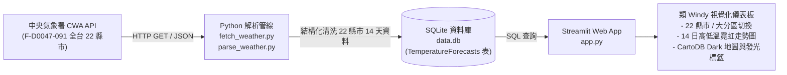

Taiwan Weather Forecast (Windy Dark Glassmorphism)  http://localhost:8501/


https://temporary-swift-fjord-76127t7.vercel.app/
> **從氣象資料到互動式天氣預報應用程式 · 類 Windy 現代暗黑玻璃擬態視覺設計**  
> 資料獲取 · 資料分析 · 資料儲存 · 資料查詢 · 視覺化展示  
> 技術棧：`CWA Open Data API` × `JSON` × `Python` × `SQLite` × `Streamlit` × `Folium Dark Map`

---

## 視覺與架構設計特色

參考 [台灣即時氣象地圖 (Windy 風格)](https://taiwan-weather-map.vercel.app/) 打造的高質感互動應用：

1. **暗黑毛玻璃擬態視覺 (Dark Glassmorphism)**：
   - 深邃暗黑主題 (`#030712`) 配搭高質感毛玻璃卡片 (`backdrop-filter: blur(16px)`)。
   - 動態呼吸燈狀態標籤（`🟢 CWA API ONLINE`）。
2. **類 Windy 多階氣溫色彩光譜 (Temperature Spectrum)**：
   - 漸層色標：`#2c7bb6` (寒冷深藍) ➔ `#7fcdbb` (舒適嫩綠) ➔ `#fdae61` (暖色亮橙) ➔ `#d73027` (酷熱鮮紅)。
3. **CartoDB Dark Matter 互動地圖**：
   - 地圖上直接以**發光氣溫數值徽章 (DivIcon Badge)** 標註全台 22 縣市。
   - 點擊標記展開專屬深色玻璃 Popup 預報資訊卡。
4. **全台 22 縣市與 14 天 (兩週) 預報**：
   - 支援依「全台 22 縣市」或「六大地理分區」切換。
   - 14 天雙曲線走勢圖 (`#F87171` 最高溫 / `#38BDF8` 最低溫)。
   - 4 大關鍵統計 KPI 指標卡。

---

## 系統整體架構與流程圖 (System Architecture)



---

## 快速啟動 (Quick Start)

### 1. 安裝套件
```bash
pip install -r requirements.txt
```

### 2. 執行資料管線 (擷取 14 天 22 縣市預報)
```bash
python fetch_weather.py
python parse_weather.py
python database.py
```

### 3. 啟動 Web 應用
```bash
streamlit run app.py
```
啟動後前往 `http://localhost:8501`。
