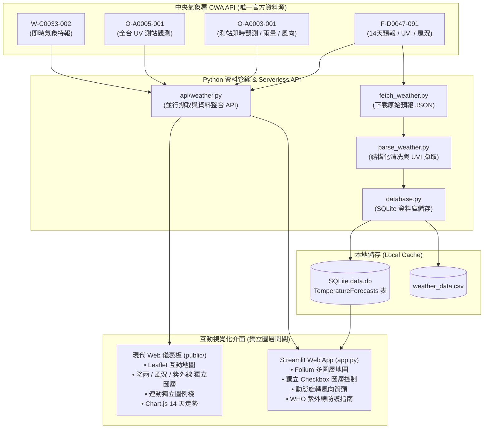

# 🌤️ Taiwan Weather Forecast — 臺灣氣候觀測與預報儀表板

> **線上展示網址**：https://weather-nine-rho-24.vercel.app/  
> **以交通部中央氣象署 (CWA) API 為唯一資料來源 · 多圖層獨立控制互動氣象地圖**  
> 資料獲取 · 結構清洗 · 資料庫儲存 · 即時觀測 · 14 天滾動預報 · 視覺化展示  
> 技術棧：`CWA Open Data API (Sole Source)` × `Python` × `SQLite` × `Leaflet / Folium` × `Streamlit` × `HTML5 / Vanilla CSS / ES6`

---

## 🌟 核心特色 (Key Features)

### 1. 唯一官方資料來源 (Sole CWA Data Source)
本專案**嚴格以交通部中央氣象署 (CWA) Open Data API 為唯一資料來源**，絕不混用任何第三方天氣服務：
- `F-D0047-091`：全台 22 縣市與分區未來 14 天滾動預報（最高低溫、風向、風速、紫外線指數 UVI 與曝曬等級）。
- `O-A0003-001`：全台無人與有人氣象測站即時觀測（即時雨量、即時風向角度、風速、氣溫、相對濕度）。
- `O-A0005-001`：中央氣象署紫外線測站全台當日峰值與即時紫外線觀測。
- `W-C0033-002`：中央氣象署即時氣象特報（豪雨、陸上強風、低溫、濃霧等警特報監控）。

---

### 2. 互動地圖獨立切換圖層 (Independent Toggleable Map Layers)
地圖將氣象資訊明確拆分為**獨立、可自由切換開啟或關閉的圖層**，使用者可任意複選或單選：

| 圖層項目 | 視覺化呈現風格 (Visualization Style) | 專屬獨立圖例 (Legend) |
| :--- | :--- | :--- |
| **🌧️ 降雨量 (Rainfall)** | **水滴標記徽章 (Droplet Badge)**<br>顯示即時雨量數值 (mm)，色階對應 CWA 雨勢等級（天藍 ➔ 湛藍 ➔ 深藍 ➔ 紫紅 豪雨）。 | 0 至 80+ mm 漸層色條與降雨分級（無雨、微量、小雨、中雨、豪雨）。 |
| **💨 風向與風速 (Wind)** | **流線氣動標籤 + 動態旋轉箭頭**<br>順應氣象署實測風向方位角度 (`rotate(${deg}deg)`) 即時旋轉指向，顏色對應蒲福風級。 | 蒲福風級漸層標籤（<3 靜風、8 和風、14 強風、>20 暴風）與動態箭頭指引。 |
| **☀️ 紫外線指數 (UV Index)** | **光芒太陽盾牌徽章 (Sunburst Shield)**<br>顯示數值 (UVI) 與 WHO 5 級色階（綠 ➔ 黃 ➔ 橙 ➔ 紅 ➔ 紫）。 | WHO / CWA 標準 5 階分級圖例（0-2 低、3-5 中、6-7 高、8-10 過量、11+ 危險）及即時防曬指南。 |
| **🌡️ 氣溫 (Temperature)** | **Google Maps 風格溫度圖釘**<br>清晰標註當前均溫、地名，點擊展開完整溫差卡片。 | 涼冷 (<18°C) ➔ 舒適 (23°C) ➔ 炎熱 (>28°C) 漸層標尺。 |

- **非互斥獨立開關**：使用者可同時開啟「降雨量 + 風向風速 + 紫外線」，亦可單獨檢視任一維度。
- **動態圖例連動**：側邊欄圖例卡片會依使用者開啟的圖層動態顯示或隱藏對應圖例。
- **智慧防遮蔽偏移 (Smart Layout Offset)**：當多圖層同時於同縣市座標啟用時，標記會自動呈環狀或側向展開排列，避免標記互相遮蔽。

---

### 3. 未來 14 天雙曲線走勢圖與氣象指標
- 提供所選縣市或區域未來兩週高低溫雙曲線走勢圖 (`#EF4444` 高溫 / `#3B82F6` 低溫)。
- 5 大關鍵統計指標：14 天平均溫、最高溫、最低溫、最大溫差、平均紫外線指數 (UVI)。
- 完整 14 天數據清單：含每日日期、高低溫、平均溫、風速、風向、紫外線指數。

---

## 🏗️ 系統架構流程圖 (System Architecture)


```mermaid
flowchart TD
    subgraph CWA_APIs ["中央氣象署 CWA API (唯一官方資料源)"]
        A1["F-D0047-091<br>(14天預報 / UVI / 風況)"]
        A2["O-A0003-001<br>(測站即時觀測 / 雨量 / 風向)"]
        A3["O-A0005-001<br>(全台 UV 測站觀測)"]
        A4["W-C0033-002<br>(即時氣象特報)"]
    end

    subgraph Backend ["Python 資料管線 & Serverless API"]
        B1["fetch_weather.py<br>(下載原始預報 JSON)"]
        B2["parse_weather.py<br>(結構化清洗與 UVI 擷取)"]
        B3["database.py<br>(SQLite 資料庫儲存)"]
        B4["api/weather.py<br>(並行擷取與資料整合 API)"]
    end

    subgraph Storage ["本地儲存 (Local Cache)"]
        C1[("SQLite data.db<br>TemperatureForecasts 表")]
        C2[("weather_data.csv")]
    end

    subgraph Frontends ["互動視覺化介面 (獨立圖層開關)"]
        D1["現代 Web 儀表板 (public/)<br>• Leaflet 互動地圖<br>• 降雨 / 風況 / 紫外線 獨立圖層<br>• 連動獨立圖例棧<br>• Chart.js 14 天走勢"]
        D2["Streamlit Web App (app.py)<br>• Folium 多圖層地圖<br>• 獨立 Checkbox 圖層控制<br>• 動態旋轉風向箭頭<br>• WHO 紫外線防護指南"]
    end

    A1 & A2 & A3 & A4 --> B4
    A1 --> B1 --> B2 --> B3 --> C1 & C2
    B4 --> D1
    C1 & B4 --> D2
```

---

## 🚀 快速啟動 (Quick Start)

### 1. 安裝環境與相依套件
確保本機已安裝 Python 3.9+：
```bash
pip install -r requirements.txt
```

### 2. 設定 CWA API 金鑰 (選填)
專案預設包含官方開放資料金鑰，若需自訂可於專案根目錄 `.env` 檔案中加入：
```env
CWA_API_KEY=YOUR_CWA_API_KEY_HERE
```

### 3. 執行資料管線 (同步 14 天預報與紫外線資料)
```bash
python fetch_weather.py
python parse_weather.py
python database.py
```
> 資料庫將建立 `data.db` 並寫入 `weather_data.csv`。

### 4. 啟動應用程式

#### 方式 A：啟動 Streamlit 應用
```bash
streamlit run app.py
```
啟動後瀏覽器自動開啟 `http://localhost:8501`。

#### 方式 B：啟動現代 Web 儀表板 (測試 API 與前端)
在專案根目錄執行：
```bash
python -m http.server 3000
```
或直接透過 Vercel 部署執行。

---

## 📁 專案檔案結構 (Project Structure)

```text
weather/
├── api/
│   └── weather.py           # Vercel Serverless API (並行聚合 CWA 預報、測站雨量、風況、UV)
├── public/
│   ├── index.html           # 現代 Web 介面 (獨立圖層開關、多圖例容器、選定點卡片)
│   ├── app.js               # 前端核心邏輯 (Leaflet LayerGroups、動態風向旋轉、圖例連動)
│   └── style.css            # 現代清晰設計系統樣式表
├── app.py                   # Streamlit 主程式 (Folium Google Maps 多圖層、獨立 Checkbox)
├── fetch_weather.py         # CWA F-D0047-091 API 擷取腳本
├── parse_weather.py         # 氣象預報與 UVI 資料結構化清洗
├── database.py              # SQLite 資料庫建立與匯入
├── data.db                  # 本地 SQLite 資料庫 (含 uvi、ws、wd 等欄位)
├── weather_data.csv         # 匯出之 14 天預報 CSV
├── vercel.json              # Vercel 部署設定
└── README.md                # 專案完整說明文件
```
