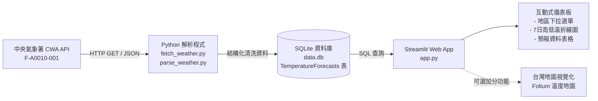

# HW10 - Taiwan Weather Forecast Workflow Guide
> **從氣象資料到互動式天氣預報應用程式**  
> 資料獲取 · 資料分析 · 資料儲存 · 資料查詢 · 視覺化展示  
> 技術棧：`CWA Open Data API` × `JSON` × `Python` × `SQLite` × `Streamlit` (可選 `Folium`)

---

## 系統整體架構與流程圖 (System Architecture)



---

## 專案目錄結構 (Project Structure)

建議目錄規劃如下：

```text
weather/
├── fetch_weather.py     # Gate 1: 呼叫 CWA API 取得原始 JSON 資料
├── parse_weather.py     # Gate 2: 解析 JSON，提取六大區域一週氣溫資料
├── database.py          # Gate 3: 建立 SQLite 資料庫與匯入資料
├── app.py               # Gate 4 & 5: Streamlit 互動式 Web App 與地圖視覺化
├── data.db              # Gate 3: SQLite 資料庫檔案
├── raw_weather.json     # (可選) 原始 API 回傳 JSON 快取
├── weather_data.csv     # (可選) 清洗後的預報資料 CSV
├── requirements.txt     # 專案相依套件清單
├── .env.example         # CWA API Key 環境變數範本
├── .gitignore           # Git 忽略設定 (.env, data.db, venv 等)
└── workflow.md          # 專案實作工作流程指引
```

---

## 環境建置與套件安裝 (Prerequisites)

### 1. 建立並啟動虛擬環境 (建議)
- **Windows (PowerShell)**:
  ```powershell
  python -m venv venv
  .\venv\Scripts\activate
  ```
- **macOS / Linux**:
  ```bash
  python3 -m venv venv
  source venv/bin/activate
  ```

### 2. 安裝必要套件
在 `requirements.txt` 中填入：
```text
requests>=2.31.0
pandas>=2.0.0
streamlit>=1.30.0
folium>=0.16.0
streamlit-folium>=0.18.0
python-dotenv>=1.0.0
```
執行安裝：
```bash
pip install -r requirements.txt
```

---

## 五個 Gate 詳細工作流程 (Five Gates Workflow)

---

### Gate 1: 取得 CWA API 資料 (權重：20%)

#### 1. 目標與規格
- 使用交通部中央氣象署 (CWA) 開放資料平台 API 取得台灣六大區域一週天氣預報。
- **資料集編號**：`F-A0010-001` (臺灣各區一週天氣預報)
- **涵蓋六大區域**：
  1. 北部地區
  2. 中部地區
  3. 南部地區
  4. 東北部地區
  5. 東部地區
  6. 東南部地區
- **資料格式**：必須使用 JSON 格式。

#### 2. 主要步驟
1. 前往中央氣象署開放資料平台取得個人 API 授權碼 (`CWA_API_KEY`)。
2. 撰寫 `fetch_weather.py`，使用 `requests.get()` 呼叫 API，並將 Header 或 Parameter 帶入授權碼。
3. 加入例外處理機制 (如 HTTP 狀態碼檢驗、連線逾時處理 `timeout=30`)。
4. 使用 `json.dumps(..., indent=2, ensure_ascii=False)` 格式化輸出並觀察 JSON 回傳層級。
5. 將取得的原始 JSON 儲存為本機快取檔案 (例如 `raw_weather.json`)，避免重複呼叫浪費 API 額度。

#### 3. 核心程式碼範例 (`fetch_weather.py`)
```python
import json
import os
import requests
from dotenv import load_dotenv

load_dotenv()
API_KEY = os.getenv("CWA_API_KEY", "YOUR_API_KEY")

URL = "https://opendata.cwa.gov.tw/api/v1/rest/datastore/F-A0010-001"
headers = {"Authorization": API_KEY}


def fetch_cwa_weather():
  response = requests.get(URL, headers=headers, timeout=30)
  response.raise_for_status()
  data = response.json()

  # 儲存與觀察 JSON
  with open("raw_weather.json", "w", encoding="utf-8") as f:
    json.dump(data, f, ensure_ascii=False, indent=2)

  print("成功取得 CWA 資料並已存入 raw_weather.json")
  return data


if __name__ == "__main__":
  fetch_cwa_weather()
```

#### 4. 驗證與評分標準
| 檢查項目 | 評分佔比 | 驗證標準 |
| :--- | :---: | :--- |
| **取得資料** | 10% | 正確透過 requests 發送請求，回傳 HTTP 200 且無報錯 |
| **觀察 JSON** | 5% | 成功格式化列印或輸出 JSON 結構，確認內含 6 個地區節點 |
| **程式品質** | 5% | API Key 未硬編碼在公開代碼中，具備適當 error handling |

---

### Gate 2: 分析 JSON，提取氣溫資料 (權重：20%)

#### 1. 目標與規格
- 分析 API 回傳之階層式 JSON，萃取六大區域未來一週（7天）每日之**最低氣溫 (MinT)** 與 **最高氣溫 (MaxT)**。
- 產出標準化資料列，格式為：`regionName`、`dataDate`、`minT`、`maxT`。

#### 2. JSON 結構分析重點
```text
records
└── locations
    └── location[] (各區：北部地區、中部地區...)
        └── weatherElement[] (天氣要素)
            ├── elementName: "MinT" (最低溫)
            │   └── time[] (各時間區間)
            │       ├── startTime / endTime
            │       └── elementValue[0].value (溫度值)
            └── elementName: "MaxT" (最高溫)
                └── time[] (各時間區間)
                    ├── startTime / endTime
                    └── elementValue[0].value (溫度值)
```

#### 3. 處理步驟與規則
1. 讀取 `raw_weather.json` 或接收 Gate 1 的回傳資料。
2. 遍歷六大目標地區：過濾或確認只包含目標的 6 大分區。
3. 提取 `MinT` 與 `MaxT` 清單，並依「日期 (YYYY-MM-DD)」對齊配對。
4. 將溫度轉換為浮點數或整數 (`float` / `int`)。
5. 整合為列表或 `pandas.DataFrame`，每筆記錄代表某地區某天的最低溫與最高溫。

#### 4. 提取結果資料格式範例
| regionName | dataDate | minT | maxT |
| :--- | :---: | :---: | :---: |
| 北部地區 | 2026-04-14 | 18 | 26 |
| 中部地區 | 2026-04-14 | 20 | 30 |
| 南部地區 | 2026-04-14 | 22 | 31 |
| 東北部地區 | 2026-04-14 | 19 | 27 |
| 東部地區 | 2026-04-14 | 20 | 28 |
| 東南部地區 | 2026-04-14 | 21 | 29 |

#### 5. 核心程式碼範例 (`parse_weather.py`)
```python
import json
import pandas as pd


def parse_weather_data(json_file="raw_weather.json"):
  with open(json_file, "r", encoding="utf-8") as f:
    data = json.load(f)

  records = data.get("records", {})
  # 依照 API 實際階層結構讀取 locations
  locations_container = records.get("locations", [])
  if isinstance(locations_container, list):
    locations = locations_container[0].get("location", [])
  else:
    locations = locations_container.get("location", [])

  parsed_records = []

  for loc in locations:
    region_name = loc.get("locationName")
    min_temp_dict = {}
    max_temp_dict = {}

    for elem in loc.get("weatherElement", []):
      elem_name = elem.get("elementName")
      if elem_name == "MinT":
        for t in elem.get("time", []):
          date = t["startTime"][:10]  # 取 YYYY-MM-DD
          val = float(t["elementValue"][0]["value"])
          min_temp_dict[date] = min(min_temp_dict.get(date, val), val)
      elif elem_name == "MaxT":
        for t in elem.get("time", []):
          date = t["startTime"][:10]
          val = float(t["elementValue"][0]["value"])
          max_temp_dict[date] = max(max_temp_dict.get(date, val), val)

    common_dates = sorted(
        list(set(min_temp_dict.keys()) & set(max_temp_dict.keys()))
    )
    for d in common_dates:
      parsed_records.append({
          "regionName": region_name,
          "dataDate": d,
          "minT": min_temp_dict[d],
          "maxT": max_temp_dict[d],
      })

  df = pd.DataFrame(parsed_records)
  df.to_csv("weather_data.csv", index=False, encoding="utf-8-sig")
  print(f"成功萃取 {len(df)} 筆預報紀錄，六大分區完整對齊。")
  return df


if __name__ == "__main__":
  parse_weather_data()
```

#### 6. 驗證與評分標準
| 檢查項目 | 評分佔比 | 驗證標準 |
| :--- | :---: | :--- |
| **提取正確** | 10% | 正確對齊 MinT 與 MaxT 日期，數值為數值型別非空值 |
| **觀察資料** | 5% | 涵蓋六大區域，每區具備一週 (7天) 完整日期維度 |
| **程式品質** | 5% | 代碼模組化、邏輯清晰無冗餘巢狀錯誤 |

---

### Gate 3: 存入 SQLite 資料庫 (權重：20%)

#### 1. 目標與規格
- 將解析後的氣溫資料存入本機 SQLite 資料庫 `data.db` 中。
- 資料表命名：`TemperatureForecasts`。

#### 2. 資料庫結構 (Schema)
```sql
CREATE TABLE IF NOT EXISTS TemperatureForecasts (
    id INTEGER PRIMARY KEY AUTOINCREMENT,
    regionName TEXT NOT NULL,
    dataDate TEXT NOT NULL,
    minT REAL NOT NULL,
    maxT REAL NOT NULL
);
```

#### 3. 處理步驟與驗證查詢
1. 撰寫 `database.py`，使用 Python 內建 `sqlite3` 連線或建立 `data.db`。
2. 執行 DDL 建立資料表 (若已存在可先清空或使用 `IF NOT EXISTS` / `REPLACE`)。
3. 批次寫入 Gate 2 萃取之資料 (可利用 `df.to_sql(..., if_exists='replace')` 或 `executemany`)。
4. 執行驗證 SQL 查詢並印出結果：
   - **驗證 1**：列出所有地區名稱
     ```sql
     SELECT DISTINCT regionName FROM TemperatureForecasts;
     ```
   - **驗證 2**：查詢特定地區（例如「中部地區」）之預報資料
     ```sql
     SELECT * FROM TemperatureForecasts WHERE regionName = '中部地區';
     ```

#### 4. 核心程式碼範例 (`database.py`)
```python
import sqlite3
import pandas as pd


def init_and_save_to_db(df):
  conn = sqlite3.connect("data.db")
  cursor = conn.cursor()

  cursor.execute("""
    CREATE TABLE IF NOT EXISTS TemperatureForecasts (
        id INTEGER PRIMARY KEY AUTOINCREMENT,
        regionName TEXT,
        dataDate TEXT,
        minT REAL,
        maxT REAL
    );
    """)

  # 清理舊資料避免重複
  cursor.execute("DELETE FROM TemperatureForecasts;")

  insert_sql = """
    INSERT INTO TemperatureForecasts (regionName, dataDate, minT, maxT)
    VALUES (?, ?, ?, ?);
    """
  records = [
      (row["regionName"], row["dataDate"], row["minT"], row["maxT"])
      for _, row in df.iterrows()
  ]
  cursor.executemany(insert_sql, records)
  conn.commit()

  # 驗證查詢 1: 列出所有地區
  cursor.execute("SELECT DISTINCT regionName FROM TemperatureForecasts;")
  regions = cursor.fetchall()
  print("驗證 1 - 儲存地區列表:", [r[0] for r in regions])

  # 驗證查詢 2: 中部地區資料
  cursor.execute(
      "SELECT * FROM TemperatureForecasts WHERE regionName = '中部地區';"
  )
  chubu = cursor.fetchall()
  print(f"驗證 2 - 中部地區共取得 {len(chubu)} 筆資料")

  conn.close()


if __name__ == "__main__":
  df = pd.read_csv("weather_data.csv")
  init_and_save_to_db(df)
```

#### 5. 驗證與評分標準
| 檢查項目 | 評分佔比 | 驗證標準 |
| :--- | :---: | :--- |
| **儲存資料** | 10% | 正確建立 `data.db` 與 `TemperatureForecasts` 表並完整插入資料 |
| **查詢驗證** | 5% | 成功以 SQL 指令執行 DISTINCT 地區與中部地區條件查詢 |
| **程式品質** | 5% | 包含資料庫連接釋放 (`close`)、事務提交 (`commit`) 與結構規範 |

---

### Gate 4: Streamlit 氣溫預報 Web App (權重：40%)

#### 1. 目標與規格
- 建立互動式 Web 應用程式 (`app.py`)。
- **資料來源規範**：**嚴禁直接呼叫 CWA API**，必須全程使用 SQL 從 `data.db` 讀取資料。
- 提供地區下拉選單切換六大區域。
- 動態繪製未來一週之最高溫 (MaxT) 與最低溫 (MinT) 折線圖。
- 顯示對應一週預報數據表格。

#### 2. UI 版面規劃
1. **主標題**：`Taiwan Weather Forecast`
2. **選單元件 (`st.selectbox`)**：
   - 標籤：`Select Region:`
   - 選項來源：動態透過 `SELECT DISTINCT regionName FROM TemperatureForecasts` 取得。
3. **區塊標題**：`Temperature Forecast - {選中地區}`
4. **折線圖 (`st.line_chart` 或 `matplotlib` / `plotly` / `altair`)**：
   - X 軸：日期 (例：04/14, 04/15, ...)
   - Y 軸：Temperature (°C)
   - 圖例標示：`MaxT` (紅線) 與 `MinT` (藍線)
5. **資料表格 (`st.dataframe` 或 `st.table`)**：
   - 欄位：`Date` | `MinT` | `MaxT`
   - 展示該地區 7 日之完整預報數據。

#### 3. 核心程式碼範例 (`app.py` 核心部分)
```python
import sqlite3
import pandas as pd
import streamlit as st

st.set_page_config(page_title="Taiwan Weather Forecast", layout="wide")
st.title("🌤️ Taiwan Weather Forecast")


@st.cache_data
def get_regions():
  conn = sqlite3.connect("data.db")
  regions_df = pd.read_sql_query(
      "SELECT DISTINCT regionName FROM TemperatureForecasts", conn
  )
  conn.close()
  return regions_df["regionName"].tolist()


def get_region_weather(region_name):
  conn = sqlite3.connect("data.db")
  query = """
        SELECT dataDate AS Date, minT AS MinT, maxT AS MaxT
        FROM TemperatureForecasts
        WHERE regionName = ?
        ORDER BY dataDate ASC
    """
  df = pd.read_sql_query(query, conn, params=(region_name,))
  conn.close()
  return df


regions = get_regions()
selected_region = st.selectbox("Select Region", regions)

if selected_region:
  df_weather = get_region_weather(selected_region)

  st.subheader(f"Temperature Forecast - {selected_region}")

  col1, col2 = st.columns([3, 2])

  with col1:
    # 轉換日期格式便於顯示
    df_chart = df_weather.set_index("Date")[["MaxT", "MinT"]]
    st.line_chart(df_chart, color=["#FF4B4B", "#1E88E5"])

  with col2:
    st.dataframe(df_weather, hide_index=True, use_container_width=True)
```

#### 4. 驗證與評分標準
| 檢查項目 | 評分佔比 | 驗證標準 |
| :--- | :---: | :--- |
| **下拉選單** | 10% | 選項來自 SQLite DISTINCT 查詢，切換能觸發視圖重新載入 |
| **折線圖與表格** | 15% | 同時呈現 MaxT/MinT 雙折線圖與 7 天對照表格 |
| **SQLite 查詢** | 10% | 確實使用 SQL 語句條件查詢，未繞過資料庫直接查 API |
| **程式品質** | 5% | 介面排版工整，採用 `@st.cache_data` 等最佳實踐 |

---

### Gate 5: 進階：台灣地圖視覺化 (加分項 / Optional)

#### 1. 目標與規格
- 製作互動式台灣地圖，標記六大區域中心座標，並依當日「平均溫度」呈現色階圓點標記。
- 建議技術：`Folium` + `streamlit-folium`。

#### 2. 溫度色階規則
| 溫度區間 (當日平均溫) | 標記代表色 | 備註說明 |
| :--- | :---: | :--- |
| **< 20°C** | 藍色 (`blue`) | 涼冷氣候 |
| **20°C ~ 25°C** | 綠色 (`green`) | 舒適溫和 |
| **25°C ~ 30°C** | 黃色 (`orange`/`yellow`) | 暖熱氣候 |
| **> 30°C** | 紅色 (`red`) | 酷熱氣候 |

#### 3. 六大區域參考經緯度
- **北部地區**：`25.04, 121.55`
- **中部地區**：`24.15, 120.67`
- **南部地區**：`22.62, 120.31`
- **東北部地區**：`24.70, 121.75`
- **東部地區**：`23.98, 121.60`
- **東南部地區**：`22.76, 121.14`

#### 4. 互動 Popup 規格
點擊或懸停在地圖標記時，需彈出視窗呈現：
- 地區名稱 (如：中部地區)
- 日期 (例：2026-04-14)
- 最低溫 (Min: 20°C)
- 最高溫 (Max: 30°C)
- 平均溫 (Avg: 25.0°C)

#### 5. 核心整合範例片段
```python
import folium
from streamlit_folium import st_folium

REGION_COORDS = {
    "北部地區": [25.04, 121.55],
    "中部地區": [24.15, 120.67],
    "南部地區": [22.62, 120.31],
    "東北部地區": [24.70, 121.75],
    "東部地區": [23.98, 121.60],
    "東南部地區": [22.76, 121.14],
}


def get_color(avg_temp):
  if avg_temp < 20:
    return "blue"
  elif 20 <= avg_temp < 25:
    return "green"
  elif 25 <= avg_temp <= 30:
    return "orange"
  else:
    return "red"


def render_map(today_df):
  m = folium.Map(location=[23.7, 121.0], zoom_start=7, tiles="CartoDB positron")
  for _, row in today_df.iterrows():
    r_name = row["regionName"]
    if r_name in REGION_COORDS:
      avg_temp = (row["minT"] + row["maxT"]) / 2
      color = get_color(avg_temp)
      popup_content = f"""
            <b>{r_name}</b><br>
            Date: {row['dataDate']}<br>
            Min: {row['minT']}°C<br>
            Max: {row['maxT']}°C<br>
            Avg: {avg_temp:.1f}°C
            """
      folium.CircleMarker(
          location=REGION_COORDS[r_name],
          radius=12,
          color=color,
          fill=True,
          fill_color=color,
          fill_opacity=0.8,
          popup=folium.Popup(popup_content, max_width=200),
          tooltip=f"{r_name}: {avg_temp:.1f}°C",
      ).add_to(m)
  st_folium(m, width=700, height=500)
```

---

## 執行與交付清單 (Execution Checklist)

### 階段一：資料處理管線 (一次性執行)
1. [ ] 執行 `python fetch_weather.py`：驗證是否順利取得 API JSON 回傳並產生 `raw_weather.json`。
2. [ ] 執行 `python parse_weather.py`：檢驗六大分區、7 天氣溫是否清洗完整並輸出。
3. [ ] 執行 `python database.py`：驗證 SQLite `data.db` 與 `TemperatureForecasts` 表已正確寫入。

### 階段二：Web 應用程式啟動與展示
4. [ ] 執行 `streamlit run app.py`。
5. [ ] 在瀏覽器測試地區下拉切換，確認折線圖與表格連動。
6. [ ] (加分項) 檢驗台灣地圖標記、色階邏輯與 Popup 資訊。

---

## 重要注意事項 (Important Notes)
1. **安全性原則**：請使用個人 CWA API Key，絕不將含 Key 之程式碼公開推送至公開 GitHub 倉庫（建議使用 `.env` 與 `.gitignore`）。
2. **架構原則**：Streamlit 必須從本機 SQLite (`data.db`) 查詢資料，**不可在 Web App 前端直接呼叫 API**。
3. **完整性原則**：必須確認「北部、中部、南部、東北部、東部、東南部」六大區域皆完整收錄，且資料天數涵蓋一週 (7天)。
